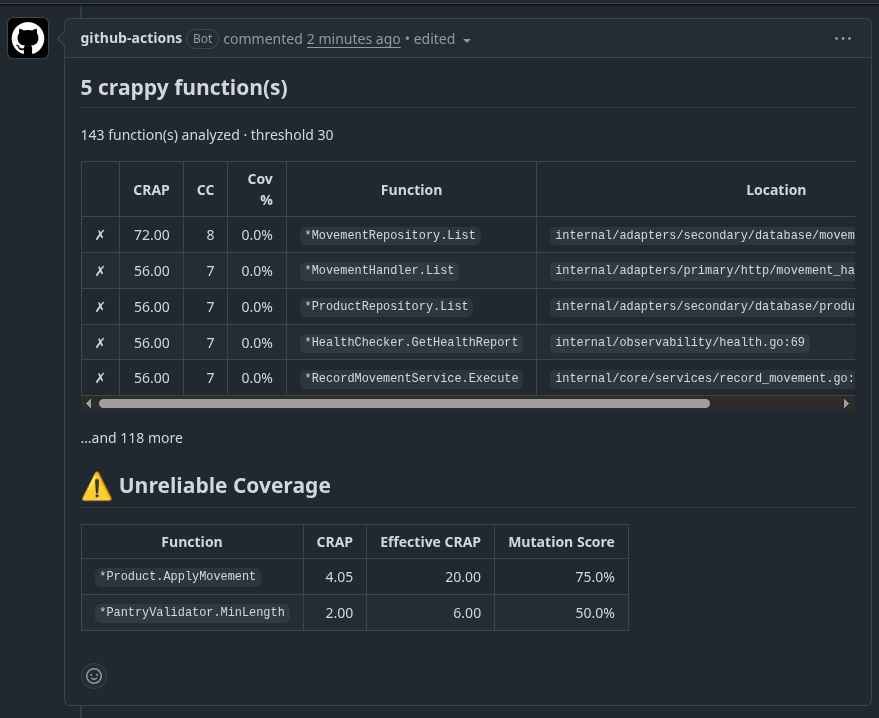
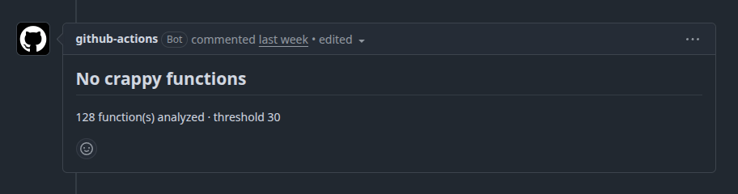

# GitHub Actions

## Badge

Show the latest master status in your `README.md`:

```markdown
[](https://github.com/YOUR_ORG/YOUR_REPO/actions/workflows/crap.yml)
```

The badge reflects the workflow result on `master`. Make sure the workflow triggers on that branch:

```yaml
on:
  push:
    branches: [master]
```

## Fail on high CRAP scores

```yaml
name: crap
on:
  push:
    branches: [main, master]
  pull_request:

jobs:
  crap:
    runs-on: ubuntu-latest
    steps:
      - uses: actions/checkout@v4
      - uses: actions/setup-go@v5
        with:
          go-version: '1.23'
          cache: true
      - name: Install go-crap
        run: go install github.com/padiazg/go-crap@latest
      - name: Run go-crap
        run: go-crap scan --fail-above --threshold 30 --exclude '.*_test\.go' --exclude 'testdata/.*\.go' --exclude '\.pb\.go$'
```

## PR annotations with JSON report

```yaml
      - name: Install go-crap
        run: go install github.com/padiazg/go-crap@latest
      - name: Run go-crap with annotations
        run: go-crap scan --format github --threshold 30 --exclude '.*_test\.go'
      - name: Generate JSON report
        run: go-crap scan --format json > crap-report.json
      - uses: actions/upload-artifact@v4
        with:
          name: crap-report
          path: crap-report.json
```

## Matrix builds across Go versions

```yaml
name: crap
on: [push, pull_request]

jobs:
  crap:
    runs-on: ubuntu-latest
    strategy:
      matrix:
        go-version: ['1.22', '1.23', '1.24']
    steps:
      - uses: actions/checkout@v4
      - uses: actions/setup-go@v5
        with:
          go-version: ${{ matrix.go-version }}
          cache: true
      - name: Install go-crap
        run: go install github.com/padiazg/go-crap@latest
      - name: Run go-crap
        run: go-crap scan --fail-above --threshold 30 --exclude '.*_test\.go'
```

## SARIF report with code scanning

```yaml
      - name: Run go-crap with SARIF output
        run: go-crap scan --format sarif --threshold 30 --exclude '.*_test\.go' > report.sarif
      - name: Upload SARIF report
        uses: github/codeql-action/upload-sarif@v3
        with:
          sarif_file: report.sarif
```

SARIF output is compatible with GitHub Advanced Security code scanning, Azure DevOps, and other tools that consume SARIF 2.1.0 reports.

## PR comment with CRAP report

```yaml
      - name: Run go-crap for PR comment
        run: go-crap scan --format pr-comment --threshold 30 --exclude '.*_test\.go' --output pr-comment.md
      - name: Comment on PR
        uses: actions/github-script@v7
        with:
          script: |
            const fs = require('fs');
            const comment = fs.readFileSync('pr-comment.md', 'utf8');
            github.rest.issues.createComment({
              issue_number: context.issue.number,
              owner: context.repo.owner,
              repo: context.repo.repo,
              body: comment
            });
```

The `pr-comment` format generates a markdown table suitable for pull request comments, showing status symbols, CRAP scores, complexity, coverage, function names, and file locations.

## Fork-safe PR comment with mutation testing

When accepting PRs from forks, the CI job's `GITHUB_TOKEN` is read-only and cannot post comments. The solution is a two-workflow pattern:

1. **Workflow 1** (`crap.yaml`) -- runs gremlins + go-crap, generates a PR comment as a markdown file, and uploads it as an artifact.
2. **Workflow 2** (`post-pr-comment.yaml`) -- triggered by `workflow_run`, runs in the base repo context with write permissions, downloads the artifact, and posts (or updates) the comment.

### Workflow 1: generate the comment

```yaml
name: crap
on:
  push:
    branches: [main, master]
  pull_request:

jobs:
  threshold:
    runs-on: ubuntu-latest
    steps:
      - uses: actions/checkout@v4
      - uses: actions/setup-go@v5
        with:
          go-version: '1.23'
          cache: true
      - name: Install go-crap
        run: go install github.com/padiazg/go-crap@latest
      - name: Score
        run: go-crap scan --fail-above --threshold 30 --exclude '.*_test\.go'

  pr-comment:
    runs-on: ubuntu-latest
    if: github.event_name == 'pull_request'
    steps:
      - uses: actions/checkout@v4
      - uses: actions/setup-go@v5
        with:
          go-version: '1.23'
          cache: true
      - name: Install gremlins
        run: go install github.com/go-gremlins/gremlins/cmd/gremlins@latest
      - name: Mutation testing
        run: >-
          gremlins unleash
          --timeout-coefficient 20
          -S "l"
          --integration
          --output=mutation-report.json
      - name: Install go-crap
        run: go install github.com/padiazg/go-crap@latest
      - name: Generate PR comment
        run: >-
          go-crap scan
          --format pr-comment
          --threshold 30
          --exclude '.*_test\.go'
          --output pr-comment.md
          --mutation-report mutation-report.json || true
      - name: Get PR number
        run: echo "${{ github.event.pull_request.number }}" > pr-number.txt
      - name: Upload artifacts
        uses: actions/upload-artifact@v4
        with:
          name: crap-comment
          path: |
            pr-comment.md
            pr-number.txt
            mutation-report.json
          if-no-files-found: ignore
```

The `|| true` on the go-crap step ensures the comment artifact is still uploaded even when functions exceed the threshold.

See [Recommended configuration](../concepts/mutation-testing.md#recommended-configuration) for an explanation of the gremlins flags.

### Workflow 2: post the comment

This workflow triggers after `crap` completes. It runs in the base repo context, so `GITHUB_TOKEN` has write access to pull requests -- even on fork PRs.

```yaml
name: post pr comment
on:
  workflow_run:
    workflows: [crap]
    types: [completed]

permissions:
  pull-requests: write
  actions: read

jobs:
  comment:
    name: Post or update PR comment
    runs-on: ubuntu-latest
    steps:
      - name: Download PR comment artifact
        uses: actions/download-artifact@v4
        with:
          name: crap-comment
          path: .
          run-id: ${{ github.event.workflow_run.id }}
          github-token: ${{ secrets.GITHUB_TOKEN }}
        continue-on-error: true

      - name: Post or update PR comment
        uses: actions/github-script@v7
        with:
          script: |
            const fs = require('fs');
            if (!fs.existsSync('pr-comment.md') || !fs.existsSync('pr-number.txt')) return;
            const body = fs.readFileSync('pr-comment.md', 'utf8');
            const prNumber = parseInt(fs.readFileSync('pr-number.txt', 'utf8').trim(), 10);
            if (!prNumber) return;
            const marker = '<!-- go-crap-report -->';
            const { data: comments } = await github.rest.issues.listComments({
              owner: context.repo.owner,
              repo: context.repo.repo,
              issue_number: prNumber,
            });
            const existing = comments.find(c => c.body.startsWith(marker));
            if (existing) {
              await github.rest.issues.updateComment({
                owner: context.repo.owner,
                repo: context.repo.repo,
                comment_id: existing.id,
                body,
              });
            } else {
              await github.rest.issues.createComment({
                owner: context.repo.owner,
                repo: context.repo.repo,
                issue_number: prNumber,
                body,
              });
            }
```

The `<!-- go-crap-report -->` marker (emitted by `--format pr-comment`) ensures the comment is updated in place on subsequent pushes instead of creating duplicates.

### Example output

Before fixing -- functions above the threshold with unreliable coverage from survived mutants:



After fixing -- all functions below the threshold, no survived mutants:


